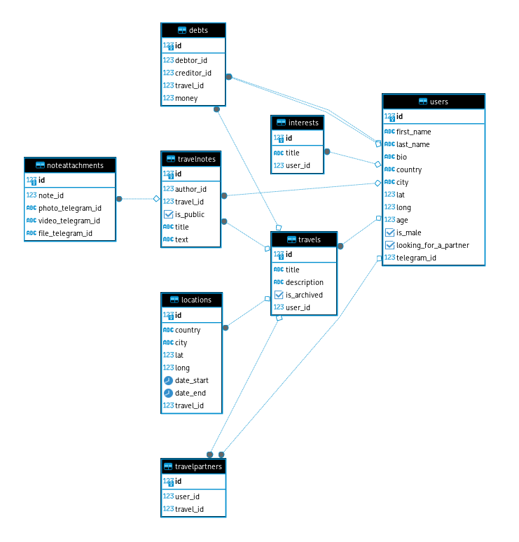

# Koltso Travel Bot Documentation - @travel_koltso_bot

### Инструкция по запуску
1. Клонируйте этот репозиторий.
2. Установите docker и docker-compose.
3. Запустите в терминале команду: `docker-compose up -d`

#### Описание `docker-compose.yml`
```yaml
version: '3'

services:
  db:
    image: postgres
    restart: always
    environment:
      POSTGRES_DB: "postgres"
      POSTGRES_USER: "postgres"
      POSTGRES_PASSWORD: "secret"
    ports:
      - "5432:5432"
    networks:
      - postgres
    healthcheck:
      test: ["CMD-SHELL", "pg_isready -U postgres"]
      interval: 5s
      timeout: 5s
      retries: 5
  redis:
    image: redis:latest
    restart: always
    ports:
      - "6379:6379"
    environment:
      - REDIS_PASSWORD=secret
      - REDIS_PORT=6379
      - REDIS_DATABASES=16
    networks:
      - postgres
  bot_service:
    build: ./
    networks:
      - postgres
    depends_on:
      db:
        condition: service_healthy

networks:
  postgres:
    driver: bridge
```
Файл `docker-compose.yml` устанавливает 3 сервиса: `bot_service`, `db` и `redis`.

- **bot_service**:
  - Этот сервис использует официальный образ `python:3.12-bullseye` из Docker Hub. Эта версия образа выбрана потому, что в ней предустановлен gcc, необходимый для сборки зависимостей python. 
  - Этот сервис собирается из текущего каталога с помощью Dockerfile, находящегося в корневом каталоге.
  - Он подключен к сети `postgres`, что позволяет взаимодействовать с сервисами `db` и `redis`.
  - Благодаря `depends_on` код не будет запущен, пока не запустится база данных.
  
- **db**:
  - Этот сервис использует официальный образ `postgres` из Docker Hub.
  - Он настроен на постоянный перезапуск, что обеспечивает автоматический перезапуск контейнера в случае сбоя.
  - Переменные окружения заданы для создания базы данных Postgres с именем "postgres", пользователем "postgres" и паролем "secret".
  - Сопоставление портов настроено так, чтобы база данных Postgres была открыта на порту 5432 хост-машины.
  - Он также подключен к сети `postgres`.
  - `healthcheck` проверяет, запущена ли база данных.
- **redis**:
  - Этот сервис использует официальный образ `redis` из Docker Hub.
  - Он настроен на постоянный перезапуск, что обеспечивает автоматический перезапуск контейнера в случае сбоя.
  - Переменные окружения заданы для создания Redis с портом 6379 и паролем "secret".
  - Сопоставление портов настроено так, чтобы Redos был открыт на порту 6379 хост-машины.
  - Он также подключен к сети `postgres`.


### Демонстрация работы 
**Сценарии использования**

**Вариант использования “Регистрация”**

Вариант использования _регистрация_ показывает как будет происходить первичное заполнение профиля персональной информацией.

Предусловие: открыть бота в telegram.

1. Происходит последовательный диалог пользователь-система, где заполняется имя и фамилия, описание профиля
2. Пользователь нажимает на одну из кнопок для выбора пола Пользователю предоставляется выбор способа указания своей геопозиции в виде 2 кнопок
    1. Автоматическая отправка геопозиции, определенной GPS
    2. Ручное заполнение локации: выбор из выпадающего списка своей страны и затем выбор города из выпадающего списка городов выбранной страны. После заполнения пользователь нажимает кнопку “Отправить”
3. Пользователь указывает свой возраст
4. Пользователь выбирает интересы, нажимая на кнопки со своими интересами, после окончания выбора нажимает на кнопку “Завершить’

Постусловие: профиль заполнен.

**Вариант использования “Главное меню”**

Вариант использования _главное меню_ показывает как будет происходить основная навигация внутри бота.

Предусловие: заполнить профиль.

1. При нажатии кнопки “Мой профиль” происходит переход к сценарию “Изменение профиля”
2. При нажатии кнопки “Мои путешествия” происходит переход к потоку событий A1, связанных с путешествиями
3. При нажатии кнопки “Архив путешествий” происходит переход к сценарию использования “Просмотр архивных путешествий”
4. При нажатии кнопки “Найти спутников” происходит переход к сценарию использования “Найти спутников”
5. При нажатии кнопки “Обратная связь” пользователю предлагается написать сообщение разработчику

**Основной поток событий А1 вариант использования “Добавление путешествия”**

Вариант использования _добавление путешествия_ показывает как будет происходить добавление информации о новом путешествии.

Предусловие: нажать кнопку “Мои путешествия” и затем нажать кнопку “Добавить путешествие”.

1. Происходит последовательный диалог система-пользователь, пользователю предлагается ввести название путешествия, описание поездки
2. Пользователь может ввести места по нажатию кнопки “Добавить место”
    1. Из выпадающего списка пользователь выбирает страну посещения
    2. Из выпадающего списка пользователь выбирает город посещения
    3. В выпадающем календаре пользователь указывает дату приезда
    4. В выпадающем календаре пользователь указывает дату отъезда, причем выполняется проверка на то, чтобы эта дата была позднее даты п.2.3
    5. После заполнения информации пользователь нажимает кнопку “Отправить”
3. После добавления места на экране появляется список уже добавленных мест
4. По нажатию кнопки “Добавить место” пользователь вводит еще одно место посещения по алгоритму п.2
5. По нажатию кнопки “Завершить создание” если мест меньше двух система выведет сообщение с просьбой ввести еще места
6. По нажатию кнопки “Завершить создание” если мест больше или равно двух пользователь должен нажать кнопку “Назад” и будет выполнен переход к странице путешествий А1.

**Основной поток событий А1 вариант использования “Удалить путешествие”**

Вариант использования _удалить путешествие_ показывает как будет происходить удаление выбранного путешествия.

Предусловие: должно быть добавлено хотя бы одно путешествие и пользователь должен нажать кнопку “Мои путешествия” и затем нажать кнопку с названием желаемого путешествия.

1. При нажатии кнопки “Удалить путешествие” появляется вопрос “Ты уверен, что хочешь удалить?”
2. Пользователь нажимает “Да” – путешествие удалено, выполнен переход к меню
3. Пользователь нажимает “Нет” – выполнен переход к путешествиям.

**Основной поток событий А1 вариант использования “Удалить место”**

Вариант использования _удалить место_ показывает как будет происходить удаление выбранного места из текущего путешествия.

Предусловие: должно быть добавлено хотя бы одно путешествие и пользователь должен нажать кнопку “Мои путешествия” и затем нажать кнопку с названием желаемого путешествия.

1. При нажатии кнопки “Удалить место” появляются кнопки с названием мест, которые добавлены в путешествие.
2. Если мест меньше трех то появится сообщение о том что удаление места невозможно
3. Пользователь нажимает кнопку места, которое хочет удалить.
4. Появляется информация об успешном удалении и при нажатии кнопки “Назад” выполняется переход к текущему путешествию.

**Основной поток событий А1 вариант использования “Изменить название”/“Изменить описание”**

Предусловие: должно быть добавлено хотя бы одно путешествие и пользователь должен нажать кнопку “Мои путешествия” и затем нажать кнопку с названием желаемого путешествия.

1. При нажатии кнопки “Изменить название” или “Изменить описание” пользователю будет предложено ввести новое название или описание
2. Появляется информация об успешном изменении и при нажатии кнопки “Назад” выполняется переход к текущему путешествию.

**Основной поток событий А1 вариант использования “Мои спутники”**

Предусловие: должно быть добавлено хотя бы одно путешествие и пользователь должен нажать кнопку “Мои путешествия” и затем нажать кнопку с названием желаемого путешествия.

1. При нажатии кнопки “Мои спутники” если у текущего пользователя еще нет спутников, появится несколько кнопок с дальнейшим выбором действий со спутниками.
    1. При нажатии кнопки “Добавить спутника” появляется переход к варианту использования “Добавить спутника” А1
    2. При нажатии кнопки найти спутников происходит переход к варианту использования “Найти спутников”
2. Если у пользователя уже есть спутники, то выведется информация о спутниках и появится кнопка “Удалить спутника”
3. При нажатии кнопки “Удалить спутника” появляются кнопки с именами спутников, пользователь выбирает одну из них и нажимает
4. Появляется информация об успешном удалении и при нажатии кнопки “Назад” выполняется переход к текущему путешествию.

**Основной поток событий А1 вариант использования “Добавить спутника”**

Вариант использования _добавить спутника_ показывает как будет происходить добавление контакта другого пользователя бота к текущему путешествию.

Предусловие: человек, которого добавляют должен быть пользователем бота. Текущий пользователь должен нажать кнопку “Мои путешествия” и затем нажать кнопку с названием желаемого путешествия.

1. При нажатии кнопки “Добавить спутника” появляется кнопка “Отправить человека”
2. При нажатии кнопки “Отправить человека” открывается список контактов telegram
3. Пользователь выбирает нужного человека и подтверждает добавление нажатием кнопки “Отправить”
4. Если человек является пользователем бота то появляется информация об успешном изменении и при нажатии кнопки “Назад” выполняется переход к текущему путешествию.
5. В противном случае предлагается добавить другого человека и выполняется переход в главное меню.

**Основной поток событий А1 вариант использования “Найти спутников”**

Вариант использования _найти спутников_ показывает как будет происходить подбор спутников среди пользователей по интересам.

Предусловие: должно быть добавлено хотя бы одно путешествие и пользователь должен нажать кнопку “Мои путешествия” и затем нажать кнопку с названием желаемого путешествия.

1. При нажатии кнопки “Найти спутников” появляется информация о возможном спутнике и кнопки “Связаться” и “Больше не ищу спутника”.
2. При нажатии кнопки “Связаться” происходить переход к контакту рекомендованного пользователя.
3. При нажатии кнопки “Больше не ищу спутника” появляется информация о том что пользователя не могут добавлять в путешествие и выполняется переход в главное меню
4. При повторном нажатии кнопки “Назад” выполняется переход в главное меню.

**Основной поток событий А1 вариант использования “Отрисовка маршрута на карте”**

Вариант использования _отрисовка маршрута на карте_ показывает как будет отображаться указанный пользователем маршрут путешествия на карте.

Предусловие: Текущий пользователь должен нажать кнопку “Мои путешествия” и затем нажать кнопку с названием желаемого путешествия.

1. При нажатии кнопки “На карте” или “На карте от меня” появляется кнопка “На Яндекс Картах” и “На Google Maps” а также сообщение с просьбой подождать загрузки отрисованной карты.
2. Через ~10с появится карта с отмеченными точками маршрута и линиями маршрута, связывающими указанные точки. Если выбран вариант “На карте от меня” то к путешествию будет добавлена точка местоположения пользователя из его профиля.
3. При нажатии кнопок “На Яндекс Картах” и “На Google Maps” будут открыты страницы Яндекс или Гугл карт с построенным маршрутом путешествия пользователя.
4. При нажатии кнопки “Назад” выполняется переход к текущему путешествию.

**Основной поток событий А1 вариант использования “Узнать погоду”**

Предусловие: должно быть добавлено хотя бы одно путешествие и пользователь должен нажать кнопку “Мои путешествия” и затем нажать кнопку с названием желаемого путешествия.

1. При нажатии кнопки “Узнать погоду” появится информации о текущей погоде во всех точках маршрута.
2. При нажатии кнопки “Назад” выполняется переход к текущему путешествию.

**Основной поток событий А1 вариант использования “Что посетить?”**

Предусловие: должно быть добавлено хотя бы одно путешествие и пользователь должен нажать кнопку “Мои путешествия” и затем нажать кнопку с названием желаемого путешествия.

1. При нажатии кнопки “Что посетить?” появится несколько кнопок мест, которые добавлены в текущее путешествие.
2. При нажатии на кнопку интересующего города появится информация об интересных достопримечательностях города.
3. При нажатии кнопки “Назад” выполняется переход к текущему путешествию.

**Основной поток событий А1 вариант использования “Где поесть?”**

Предусловие: должно быть добавлено хотя бы одно путешествие и пользователь должен нажать кнопку “Мои путешествия” и затем нажать кнопку с названием желаемого путешествия.

1. При нажатии кнопки “Где поесть?” появится несколько кнопок мест, которые добавлены в текущее путешествие.
2. При нажатии на кнопку интересующего города появится информация о хороших местах, где можно поесть.
3. При нажатии кнопки “Назад” выполняется переход к текущему путешествию.

**Основной поток событий А1 вариант использования “Выбрать отель”**

Предусловие: должно быть добавлено хотя бы одно путешествие и пользователь должен нажать кнопку “Мои путешествия” и затем нажать кнопку с названием желаемого путешествия.

1. При нажатии кнопки “Выбрать отель” появится несколько кнопок мест, которые добавлены в текущее путешествие.
2. При нажатии на кнопку интересующего города появится информация об одном из отелей с фотографиями отеля.
3. Навигация между отелями происходит на нажатию кнопок со стрелками вправо и влево.
4. При нажатии кнопки “Назад” выполняется переход к текущему путешествию.

**Основной поток событий А1 вариант использования “Архивировать”**

Вариант использования _архивировать_ показывает как пользователь может убрать прошедшие и неактуальные путешествия в раздел архива.

Предусловие: должно быть добавлено хотя бы одно путешествие и пользователь должен нажать кнопку “Мои путешествия” и затем нажать кнопку с названием желаемого путешествия.

1. При нажатии кнопки “Архивировать” путешествие будет перемещено в раздел “Архив путешествий”
2. При нажатии кнопки “Назад” выполняется переход к текущему путешествию.

**Основной поток событий А1 вариант использования “Помощь со сбором”**

Вариант использования _помощь со сбором_ показывает как будет осуществляться подбор списка рекомендованных вещей для поездки с учетом цели путешествия и погоды в городах.

Предусловие: должно быть добавлено хотя бы одно путешествие и пользователь должен нажать кнопку “Мои путешествия” и затем нажать кнопку с названием желаемого путешествия.

1. При нажатии кнопки “Помощь со сбором” появится вопрос о цели путешествия, пользователь нажимает одну из кнопок.
2. Появляется список вещей, которые рекомендуется взять в путешествие и при нажатии кнопки “Назад” выполняется переход к текущему путешествию.

**Основной поток событий А1 вариант использования "Совместные траты”**

Вариант использования _совместные траты_ показывает как будет осуществляться расчет трат между спутниками. Это позволяет не запутаться кто сколько платит и всегда иметь актуальную информацию о долге друг перед другом.

Предусловие: должно быть добавлено хотя бы одно путешествие и пользователь должен нажать кнопку “Мои путешествия” и затем нажать кнопку с названием желаемого путешествия.

1. При нажатии кнопки “Совместные траты” информация о текущем долге пользователя и долге перед ним его спутников.
2. При нажатии на кнопку “Купить в сплит” системой будет предложено ввести общую сумму покупки.
3. Будет список спутников путешествия.
4. При нажатии на кнопку спутника будет предложено ввести сумму долга этого спутника.
5. Затем появится кнопка “Добавить еще человека”. При нажатии кнопки будут повторятся предыдущие шаги.
6. При нажатии кнопки “Завершить” появится информация о текущем долге пользователя после вычета его трат.
7. При нажатии кнопки “Прикрепить фото чека” будет предложено прикрепить фотографию чека.
8. При нажатии кнопки “Назад” выполняется переход к текущему путешествию.

**Основной поток событий А1 вариант использования “Заметки”**

Вариант использования _заметки_ показывает как будет осуществляться хранение и пополнение информации о путешествии. В заметки можно добавлять билеты, чеки, какую-либо текстовую информацию, видео и другое.

Предусловие: должно быть добавлено хотя бы одно путешествие и пользователь должен нажать кнопку “Мои путешествия” и затем нажать кнопку с названием желаемого путешествия.

1. При нажатии кнопки “Заметки” пользователю предоставляется выбор создания публичной или приватной заметки. Публичные заметки могут видеть спутники текущего пользователя, приватные заметки может видеть только текущий пользователь.
2. После выбора типа заметки пользователю предлагается ввести название заметки.
3. Затем пользователь может ввести любую информацию в эту заметку, включая текст, фото, видео, файл, нажав на соответствующую кнопку и прикрепить артефакт или написать текст.
4. После окончания редактирования заметки пользователь нажимает кнопку “Готово” и выполняется переход ко всем заметкам.
5. По нажатию на одну из существующих заметок пользователь может посмотреть прикрепленные файлы, заменить их или добавить еще нажатием на соответствующие кнопки.
6. При нажатии кнопки назад выполняется переход ко всем заметкам.
7. При повторном нажатии кнопки “Назад” выполняется переход к текущему путешествию.

**Вариант использования “Просмотр архивных путешествий”**

Вариант использования _просмотр архивных путешествий_ показывает как будет осуществляться хранение и просмотр путешествий, которые были отправлены в раздел архива. Варианты использования внутри этого потока аналогичны тем, что есть в основном разделе путешествий, описанных выше.

### Описание внешних интеграций 
#### СУБД - PostgreSQL
- Данная СУБД была использована, потому что:
1) В отличие от SQLite данная СУБД расширяема и может быть масшатабируема на большие проекты.
2) Производительность PostgreSQL выше, чем у MySQL.
3) Из-за множества полей, которые необходимо обрабатывать внутри проекта перед отображением их пользователю выбор пал на реляционную БД.
4) Сложность конфигурирования и управления не является критическим, т.к. благодаря активному сообществу пользователей и разработчиков, существует обширная документация PostgreSQL, что облегчает его использование в проекте. Для пользователей развёртка проекта не является проблемой, благодаря docker-compose, который осуществляет сборку и запуск.
#### Геокодер и карты - Open Street Map
- Данный сервис был выбран, т.к.:
1) **Open-source.**
2) Постоянно пополняется энтузиастами.
3) Хорошо задокументирована, активное сообщество.
4) Обширный функционал, позволяющий создавать маршруты, отрисовывать их на карте, получать информацию о точке, заданной координатами.
- Яндекс Карты и Google Maps способны предоставить более точные карты, но они проприетарные, что в последствии может привести к остановке развития продукта.
- К сожалению, на OSM есть несколько неточностей, например, Крым по данным этой карты относится к Украине. Но это не является существенный недостатком, т.к. каждый пользователь может вносить изменения в карту, поэтому неточности в дальнейшем будут исправлены.
#### Геокодер - Yandex GeoCoder
- Данный сервис был выбран, как вспомогательный, т.к.:
1) Более точное определение населённых пунктов, чем OSM
2) Полностью бесплатное API
#### Прокладывание маршрута - Open Source Routing Machine
- Этот open-source сервис, созданный на C++ используется, чтобы прокладывать маршрут по координатам начальной и конечной точек. Этот сервис использует OSM, описанный выше.
#### LLM - GigaChat
- Среди LLM данный сервис обладает следующими приемуществами:
1) Большое количество бесплатных запросов
2) Способна генерировать JSON в качестве результата
3) В последствии можно оплачивать, используя карту российского банка
4) Возможность использования без VPN
5) Качество работы на уровне GPT-3.5 от OpenAI
6) Возможность интегрирования LangChain для актуализации информации через поиск в интернете перед запросом к ИИ
- Также в дальнейшем при развёртке проекта на большое число пользователей имеет смысл перейти на Open Source LLM, такие как, например, LLaMA. В MVP была использована проприетарная модель, т.к. для обучение модели требуются большие ресурсы и затраты.
#### Хранилище состяния пользователя - Redis
- Использование Redis обусловлено быстрой работой, способность не сбрасывать данные при перезагрузке приложения.
#### Поставщик данных о погоде - OpenWeatherMap
- В качестве поставщика данных о погоде был использована именно OpenWeatherMap, т.к.
1) Благодаря поддержке множества языков, проект можно интернационализировать.
2) Возможность использования как метрической системы измерения, так и имперской.
3) Бесплатные данные о текущей погоде
4) Точность измерений
- В боте отображается именно текущая погода в местах, которые планирует посетить пользователь. Это сделано намеренно, потому что так пользователь может сам оценить разность температур в различных городах. На данный момент никакой сервис не может точно предсказать погоду на будущее, особенно в горах и на море, куда люди часто планируют свои поездки.
#### Поставщик данных об отелях и кафе - FourSquare
- Данные об отелях и кафе используются от сервиса FourSquare, т.к.:
1) Это API бесплатное
2) Есть информация об адресе, ценах, предоставлен рейтинг, фото каждого места
3) Не требует ввода карты иностранного банка
### Схема данных СУБД 

#### User
|Поле|Тип данных, техническое описание|Описание|
|---|---|---|
|id|serial4, unique, primary_key|id пользователя|
|first_name|varchar, max_length=255|имя пользователя|
|last_name|varchar, max_length=255|фамилия пользователя|
|bio|text|краткое описание о пользователе|
|country|varchar, max_length=100|страна проживания пользователя|
|city|varchar, max_length=255|город проживания пользователя|
|lat|float8|широта города проживания пользователя|
|long|float8|долгота города проживания пользователя|
|age|int4|возраст пользователя|
|is_male|bool|пол пользователя|
|looking_for_a_partner|bool|ищет ли пользователь партнёра|
|telegram_id|int8|telegram id пользователя|
#### Interest
|Поле|Тип данных, техническое описание|Описание|
|---|---|---|
|id|serial4, unique, primary_key|id интереса|
|title|varchar, max_length=100|название интереса|
|user_id|int8, foreign key to user `telegram_id`|telegram id пользователя, кому принадлежит этот интерес|
#### Travel
|Поле|Тип данных, техническое описание|Описание|
|---|---|---|
|id|serial4, unique, primary_key|id путешествия|
|title|varchar, max_length=255|название путешествия|
|description|text|фамилия пользователя|
|is_archived|bool|архивировано ли путешествие|
|user_id|int8, foreign key to user `telegram_id`|telegram id пользователя-автора локации|
#### Location
|Поле|Тип данных, техническое описание|Описание|
|---|---|---|
|id|serial4, unique, primary_key|id места|
|country|varchar, max_length=255|страна места|
|city|varchar, max_length=255|город места|
|lat|float8|широта места|
|long|float8|долгота места|
|date_start|date|дата приезда|
|date_end|date|дата выезда|
|travel_id|int4, foreign key to travel `id`|id путешествия, которое содержит это место|
#### Travel Partner
|Поле|Тип данных, техническое описание|Описание|
|---|---|---|
|id|serial4, unique, primary_key|id спутника|
|user_id|int8, foreign key to user `telegram_id`|telegram id пользователя-спутника|
|travel_id|int4, foreign key to travel `id`|id путешествия, которое содержит этого спутника|
#### Travel Note
|Поле|Тип данных, техническое описание|Описание|
|---|---|---|
|id|serial4, unique, primary_key|id заметки|
|author_id|int8, foreign key to user `telegram_id`|telegram id пользователя-автора заметки|
|travel_id|int4, foreign key to travel `id`|id путешествия, которое содержит эту заметку|
|is_public|bool|публичная ли эта заметка|
|title|varchar, max_length=255|название заметки|
|text|text|текст заметки|
#### Note Attachment
|Поле|Тип данных, техническое описание|Описание|
|---|---|---|
|id|serial4, unique, primary_key|id приложения к заметке|
|note_id|int4, foreign key to note `id`|id заметки, которая содержит это приложение|
|photo_telegram_id|varchar, max_length=255|id файла фото|
|video_telegram_id|varchar, max_length=255|id файла видео|
|file_telegram_id|varchar, max_length=255|id файла|
#### Debt
|Поле|Тип данных, техническое описание|Описание|
|---|---|---|
|id|serial4, unique, primary_key|id займа|
|debtor_id|int8, foreign key to user `telegram_id`|id пользователя, который взял займ
|creditor_id|int8, foreign key to user `telegram_id`|id пользователя, который получил займ
|travel_id|int4, foreign key to travel `id`|id путешествия, которое содержит этот займ|
|money|float8|сумма, которая была одолжена|